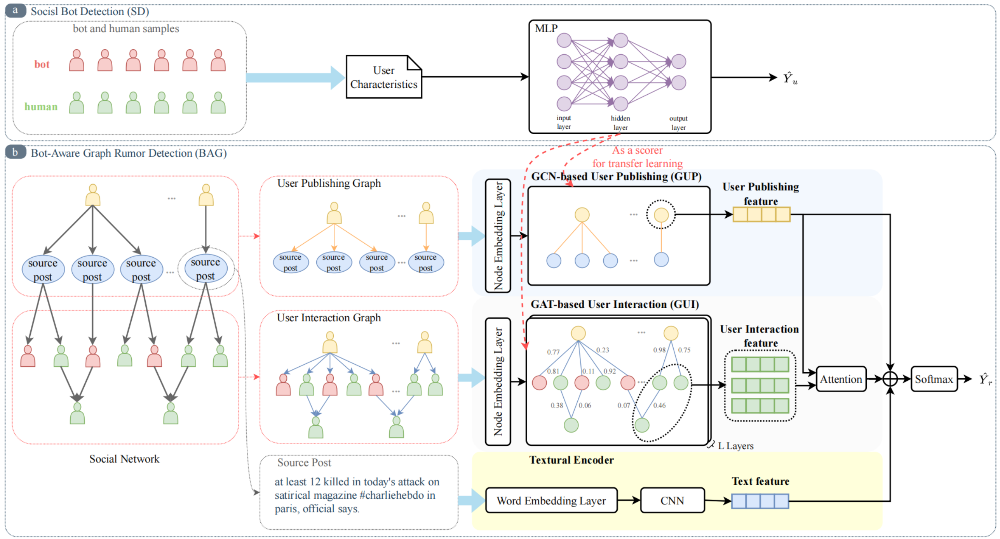

# Social Bot-Aware Graph Neural Network for Early Rumor Detection:

Zhen Huang, Zhilong Lv, Xiaoyun Han, Binyang Li, Menglong Lu, Dongsheng Li. Social Bot-Aware Graph Neural Network for Early Rumor Detection
Paper link: [Social Bot-Aware Graph Neural Network for Early Rumor Detection](https://aclanthology.org/2022.coling-1.580/)
# Introduction:
Early rumor detection is a key challenging task to prevent rumors from spreading widely. Sociological research shows that social bots’ behavior in the early stage has become the main reason for rumors’ wide spread. However, current models do not explicitly distinguish genuine users from social bots, and their failure in identifying rumors timely. Therefore, this paper aims at early rumor detection by accounting for social bots’ behavior, and presents a Social Bot-Aware Graph Neural Network, named SBAG. SBAG firstly pre-trains a multi-layer perception network to capture social bot features, and then constructs multiple graph neural networks by embedding the features to model the early propagation of posts, which is further used to detect rumors. Extensive experiments on three benchmark datasets show that SBAG achieves
significant improvements against the baselines and also identifies rumors within 3 hours while maintaining more than 90% accuracy.
# Dependencies:
Gensim==3.7.2

Jieba==0.39

Scikit-learn==0.21.2

Pytorch==1.5.1


# DataSet
we conduct experiments on three benchmark dataset，Twitter15, Twitter16 and Weibo16.

# Code
* SocialBotTrain: The codes about pre-train social bot detection module, the **SocialBotTrain/model/Propagation.py** is the module code,  **SocialBotTrain/model/trainer.py** is used for the training process of social bot detection task.
* dataset: The folder contains Twitter15, Twitter16 and Weibo16 datasets.
* model: The codes about rumor detection module.
* main: The code of the training process of rumor detection task.

# run
Before runing the code, you need to utilize Twitter API to crawl user characteristics based on user ID as the artical' Experimental setting and pre train the socail bot detection module.
```
python main.py
```

## Citation
If you find this code useful in your research, please cite our paper:
```
@inproceedings{huang-etal-2022-social,
    title = "Social Bot-Aware Graph Neural Network for Early Rumor Detection",
    author = "Huang, Zhen  and
      Lv, Zhilong  and
      Han, Xiaoyun  and
      Li, Binyang  and
      Lu, Menglong  and
      Li, Dongsheng",
    booktitle = "Proceedings of the 29th International Conference on Computational Linguistics",
    month = oct,
    year = "2022",
    address = "Gyeongju, Republic of Korea",
    publisher = "International Committee on Computational Linguistics",
    url = "https://aclanthology.org/2022.coling-1.580",
    pages = "6680--6690",
    abstract = "Early rumor detection is a key challenging task to prevent rumors from spreading widely. Sociological research shows that social bots{'} behavior in the early stage has become the main reason for rumors{'} wide spread. However, current models do not explicitly distinguish genuine users from social bots, and their failure in identifying rumors timely. Therefore, this paper aims at early rumor detection by accounting for social bots{'} behavior, and presents a Social Bot-Aware Graph Neural Network, named SBAG. SBAG firstly pre-trains a multi-layer perception network to capture social bot features, and then constructs multiple graph neural networks by embedding the features to model the early propagation of posts, which is further used to detect rumors. Extensive experiments on three benchmark datasets show that SBAG achieves significant improvements against the baselines and also identifies rumors within 3 hours while maintaining more than 90{\%} accuracy.",
}
```

